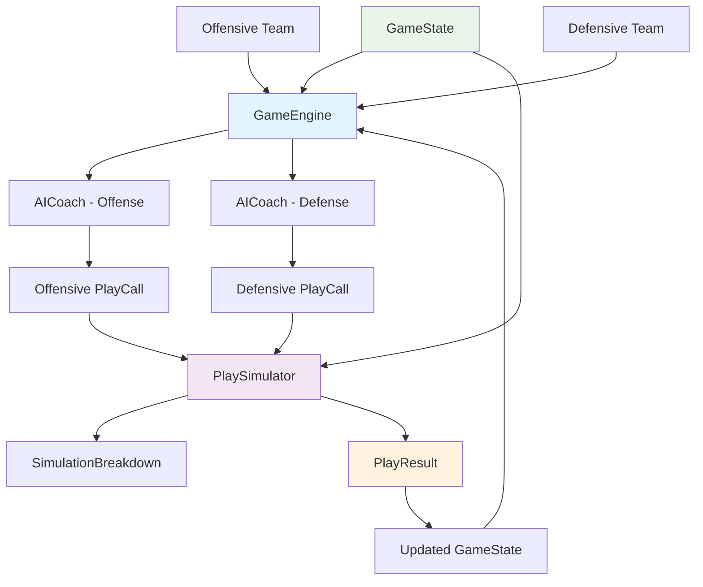
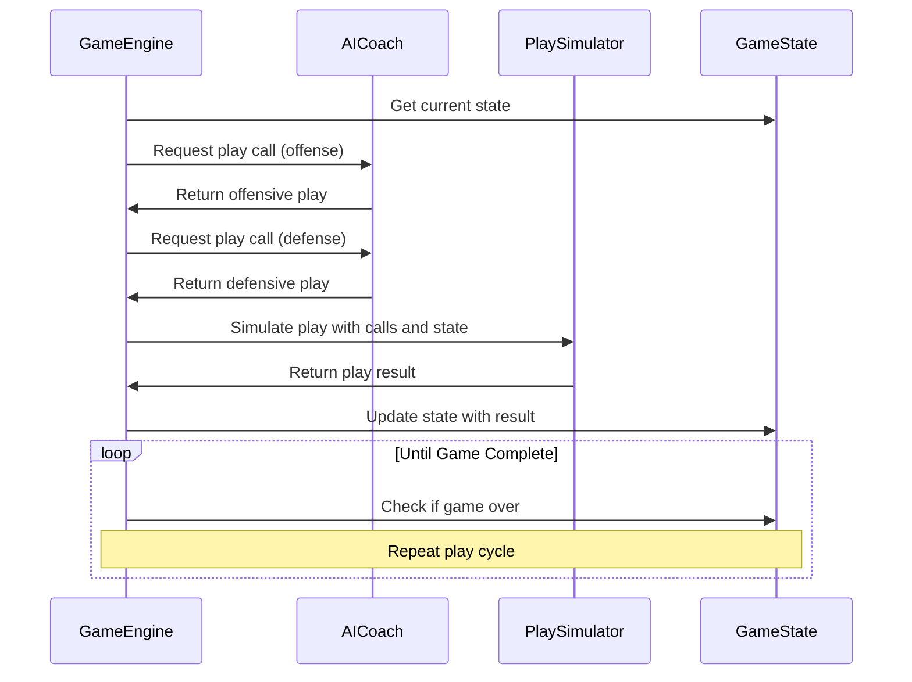
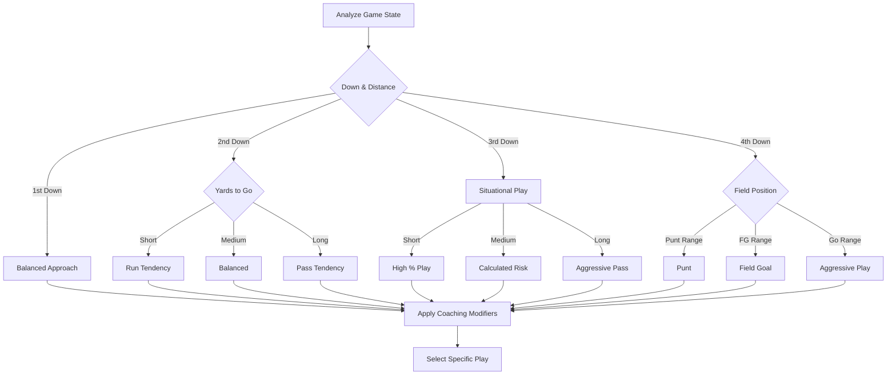
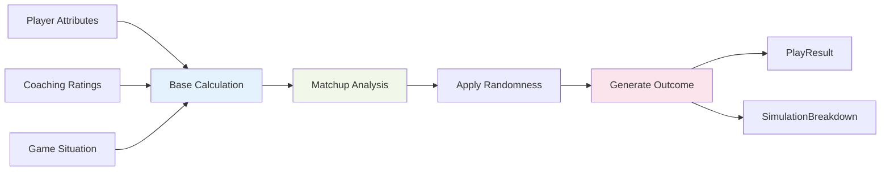

# Game Engine Architecture

## Overview

The Pro Football Clone game engine is a sophisticated football simulation system built in Dart that realistically models American football gameplay. The engine combines strategic AI decision-making, detailed player statistics, and realistic play simulation to create an engaging football management experience.

### Key Design Principles

- **Realism**: Authentic football mechanics based on NFL rules and statistics
- **Transparency**: Detailed simulation breakdowns showing how outcomes are calculated
- **Flexibility**: Modular design allowing for easy expansion and customization
- **Performance**: Efficient simulation capable of running full seasons quickly

## Core Components

The game engine consists of several interconnected components that work together to simulate football games:

### 1. GameEngine (Main Orchestrator)

The `GameEngine` class serves as the central coordinator that manages the entire game simulation process. It maintains the game state and orchestrates the interaction between AI coaches and the play simulator.

**Key Responsibilities:**
- Initialize and manage game state
- Coordinate between offensive and defensive teams
- Process play results and update game state
- Handle special game situations (timeouts, penalties, etc.)

### 2. AICoach (Strategic Decision Maker)

The `AICoach` class represents the artificial intelligence that makes strategic decisions for computer-controlled teams. It analyzes the current game situation and selects appropriate plays based on various factors.

**Decision Factors:**
- Current down and distance
- Field position
- Score differential
- Time remaining
- Team strengths and weaknesses
- Coaching staff ratings and tendencies

### 3. PlaySimulator (Physics Engine)

The `PlaySimulator` class is the heart of the gameplay mechanics. It takes play calls from both teams and simulates the actual execution, considering player attributes, matchups, and random factors.

**Simulation Elements:**
- Player attribute calculations
- Matchup analysis (offense vs defense)
- Coaching scheme bonuses
- Random variance for unpredictability
- Special situation handling

### 4. Data Models

#### GameState
Represents the current state of the game at any point in time, including:
- Score (home/away)
- Current possession
- Down and distance
- Field position
- Time remaining
- Quarter information

#### PlayCall
Defines the intended action for a play, including:
- Play type (pass, run, special teams)
- Specific play variant
- Key players involved
- Coaching staff influence

#### PlayResult
Contains the outcome of a simulated play:
- Yards gained/lost
- Time elapsed
- Special outcomes (turnovers, scores)
- Clock management effects
- Player involvement details

#### SimulationBreakdown
Provides detailed logging of simulation calculations for transparency and debugging.

## Data Flow Architecture

## Detailed Component Analysis

### GameEngine Flow

The GameEngine follows this execution pattern:

1. **Initialization**: Set up initial game state with teams and game parameters
2. **Play Loop**: Continue until game completion
   - Analyze current game state
   - Get play calls from AI coaches
   - Simulate the play
   - Update game state with results
   - Handle special situations
3. **Game Completion**: Final statistics and results

### AICoach Decision Making

The AICoach uses a sophisticated decision tree that considers multiple factors:

#### Situational Analysis
- **Down and Distance**: Different strategies for 1st & 10 vs 3rd & long
- **Field Position**: Conservative play near own goal, aggressive in red zone
- **Score Differential**: Protect lead vs catch-up scenarios
- **Time Management**: Clock control vs hurry-up offense

#### Play Selection Algorithm

### PlaySimulator Mechanics

The PlaySimulator uses a multi-layered approach to determine play outcomes:

#### 1. Base Calculation
- Extract relevant player attributes
- Calculate offensive capability score
- Calculate defensive resistance score

#### 2. Matchup Analysis
- Compare offensive vs defensive ratings
- Apply situational modifiers
- Factor in coaching scheme bonuses

#### 3. Outcome Generation
- Apply randomness within realistic bounds
- Determine yards gained/lost
- Calculate special outcomes (turnovers, big plays)
- Set appropriate time elapsed

#### 4. Result Packaging
- Create detailed PlayResult object
- Generate SimulationBreakdown for transparency

## Play Types and Simulation

### Offensive Plays

#### Passing Plays
- **Hail Mary**: Low success rate, high reward potential
- **Deep Pass**: Moderate success, big play potential
- **Medium Pass**: Balanced risk/reward
- **Short Pass**: High success, consistent gains
- **Screen Passes**: Deceptive plays with YAC potential

#### Running Plays
- **Power Run**: High success in short yardage
- **Inside Run**: Consistent between-the-tackles gains
- **Outside Run**: Speed-based perimeter attack
- **Jet Sweep**: Misdirection with big play potential
- **Read Option**: QB decision-based flexibility
- **QB Run**: Mobile quarterback advantage

#### Special Teams
- **Field Goal**: Distance and kicker skill based
- **Punt**: Field position battle

### Defensive Strategies

- **Balanced**: Equal run/pass defense
- **Blitz**: High pressure, high risk
- **Defend Pass**: Coverage focused
- **Defend Run**: Run stopping emphasis
- **Prevent**: Deep protection
- **Stack the Box**: Run stuffing formation

## Attribute Integration

The engine integrates player attributes from the generator system:

### Key Offensive Attributes
- **Speed**: Affects breakaway potential and YAC
- **Strength**: Important for power running and blocking
- **Accuracy**: Critical for QB passing success
- **Hands**: Receiver catching ability
- **Vision**: Running back hole-finding ability

### Key Defensive Attributes
- **Tackling**: Primary factor in limiting YAC
- **Coverage**: Pass defense capability
- **Pass Rush**: QB pressure generation
- **Run Defense**: Gap filling and tackle breaking

### Coaching Impact
- **Offensive Scheme**: Play calling tendencies and bonuses
- **Defensive Scheme**: Coverage preferences and effectiveness
- **Game Management**: Situational decision quality

## Performance Characteristics

### Simulation Speed
- Single play: ~1-5ms
- Full game: ~1-3 seconds
- Full season: ~30-60 seconds

### Realism Factors
- Statistical outcomes match real NFL distributions
- Situational play calling reflects actual coaching strategies
- Player performance correlates with ratings
- Random variance prevents predictable outcomes

## Extension Points

The modular design allows for easy expansion:

### New Play Types
- Add enum values to PlayCall
- Implement simulation logic in PlaySimulator
- Update AICoach decision trees

### Advanced Statistics
- Extend PlayResult with additional metrics
- Enhance SimulationBreakdown logging
- Add post-game analysis capabilities

### AI Improvements
- More sophisticated coaching personalities
- Learning algorithms for play calling
- Advanced situational awareness

## Debugging and Transparency

The SimulationBreakdown system provides complete visibility into play calculations:

- Step-by-step attribute calculations
- Matchup analysis details
- Random factor applications
- Final outcome determination

This transparency is crucial for:
- Balancing gameplay mechanics
- Understanding unexpected outcomes
- Debugging simulation issues
- Player education about game mechanics

## Conclusion

The Pro Football Clone game engine represents a sophisticated approach to football simulation, balancing realism with performance while maintaining complete transparency in its calculations. The modular architecture ensures extensibility while the detailed logging system provides insights into every aspect of the simulation process.

The engine successfully captures the strategic depth and unpredictable excitement of American football while providing the foundation for a comprehensive football management experience.
